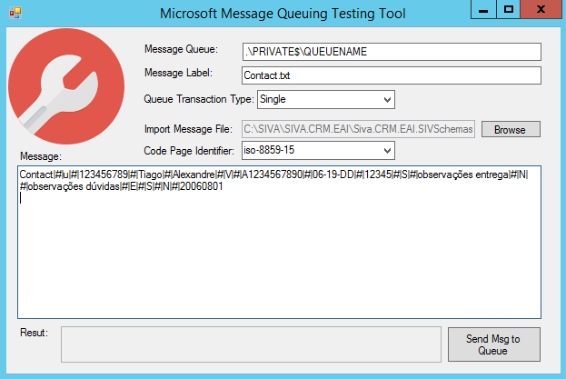

# Microsoft Message Queuing Testing Tool
“Microsoft Message Queuing Testing Tool” is a simple tool that you can use to test sending files to Microsoft Queue.

Microsoft Message Queuing or MSMQ is a message queue implementation developed by Microsoft and deployed in its Windows Server operating systems and enables applications running at different times to communicate across heterogeneous networks and systems that may be temporarily offline. It provides guaranteed message delivery, efficient routing, security, and priority-based messaging.

Message Queuing can be used to implement solutions to both asynchronous and synchronous scenarios requiring high performance. The following list shows several places where Message Queuing can be used.
* **Mission-critical financial services**: for example, electronic commerce.
* **Embedded and hand-held applications**: for example, underlying communications to and from embedded devices that route baggage through airports by means of an automatic baggage system.
* **Outside sales**: for example, sales automation applications for traveling sales representatives.
* **Workflow**: Message Queuing makes it easy to create a workflow that updates each system. A typical design pattern is to implement an agent to interact with each system. Using a workflow agent architecture also minimizes the impact of changes in one system on the other systems. With Message Queuing, the loose coupling between systems makes upgrading individual systems simpler.

With this tool, you can easily send messages to a queue in order to evaluate whether other applications are reading correctly the messages. 

# Description
This tool allows you to set:
* The queue where you want to send the files/messages
* A Label associated with the file/message
* Import an existing file or manually add a message
* Set code page identifier of the document
* The Queue transaction type

And it will provide:
* a success of delivery information (with transaction id)
* or error detail information

# Release Notes
Version 2.0 brings:
* Improvements in the “Message Label” auto fill
* Improvements in the “Import Message File” functionality with better control of the encoder associated with the file
* Add the ability to choose the code page identifier 

# About Me
Sandro Pereira | DevScope | MVP & MCTS BizTalk Server 2010 | http://sandroaspbiztalkblog.wordpress.com/ | @sandro_asp